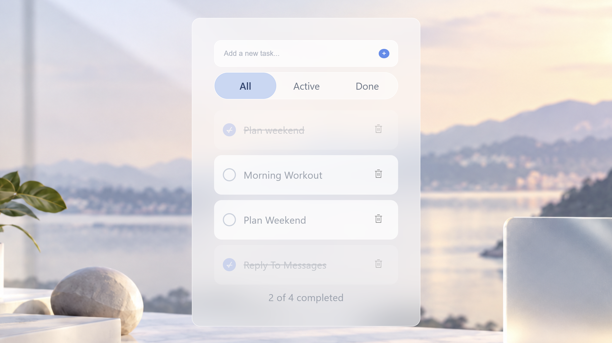

# Daylist — React To-Do App

A to-do app built with React and Vite. Add tasks, mark them
complete, delete them, and filter by status.

## Features
- Add, toggle, and delete tasks
- Filter by All / Active / Done
- Completed counter
- Glassmorphism UI

## Built with
- React (useState, props, component composition)
- Vite
- CSS

## What I learned
Managing state in React, lifting state up so child components
can update a parent's data, deriving values instead of storing
them, and updating state immutably with spread and filter.